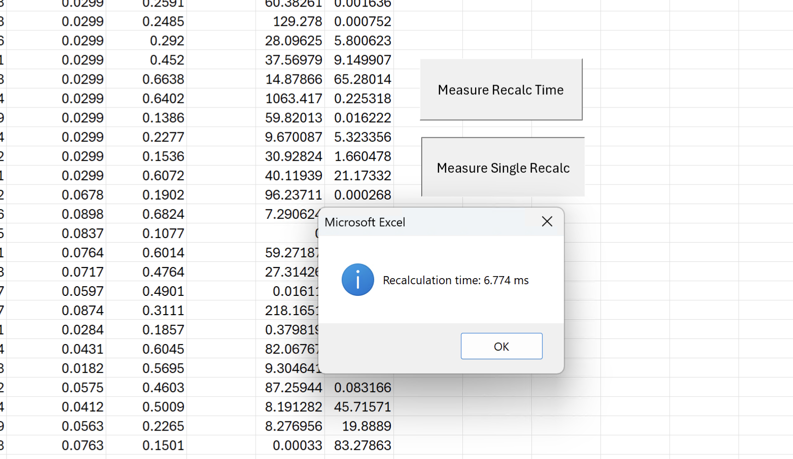

# Example ZigXLL Project

Example project showing how to use ZigXLL to create custom Excel functions.

## Download

**Download the latest release [here](https://github.com/AlexJReid/zigxll/releases/latest).** This binary is code signed by [Lexvica Limited](https://lexvica.com).

## Quick Start

```bash
zig build
```

Output: `zig-out/lib/my_excel_functions.xll`

If you download an artifact from this repo you will need to unzip the file and unblock it. More info: https://support.microsoft.com/en-gb/topic/excel-is-blocking-untrusted-xll-add-ins-by-default-1e3752e2-1177-4444-a807-7b700266a6fb

## Example Functions

- `ZigXLL.DOUBLE(x)` - Doubles a number
- `ZigXLL.REVERSE(text)` - Reverses a string
- `ZigXLL.BS_CALL(S, K, T, r, sigma)` - Black-Scholes call option price
- `ZigXLL.BS_PUT(S, K, T, r, sigma)` - Black-Scholes put option price
- `ZigXLL.TIMER()` - Live ticking counter (RTD wrapper)
- `ZigXLL.SLOW_DOUBLE(x)` - Double a number asynchronously (simulates slow computation)
- `ZigXLL.MONTE_CARLO(batches, samples_per_batch)` - Estimate pi via Monte Carlo with live progress updates

## Performance

`ZigXLL.BS_CALL` and `ZigXLL.BS_PUT` are exercised in the .xlsm sheet in this directory, showing performance with 1000 input rows. As both call and put are calculated this is 2000 calculations. Add some more if you want! On a *very* basic test PC (AMD Ryzen 5500U) I see this complete in  ~4-6ms.


